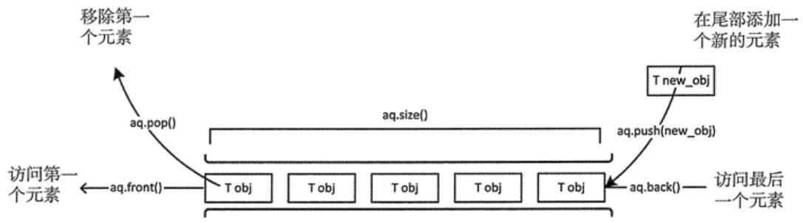
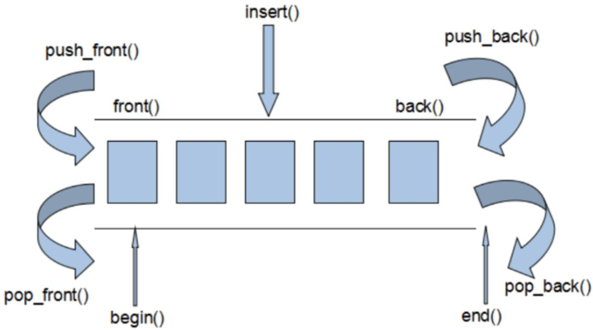
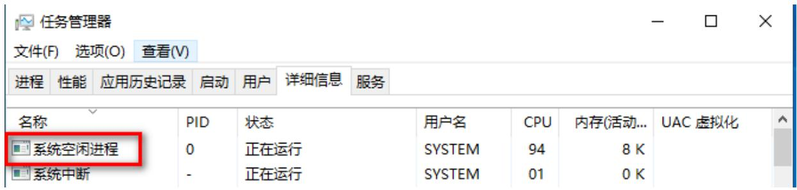
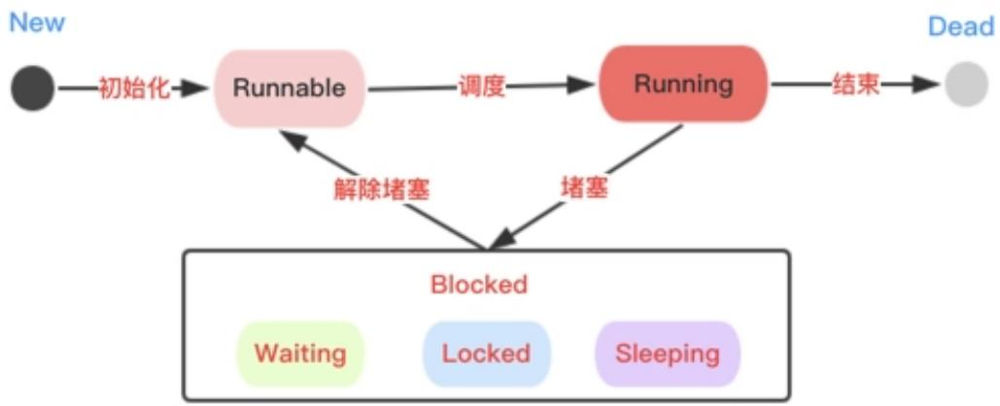
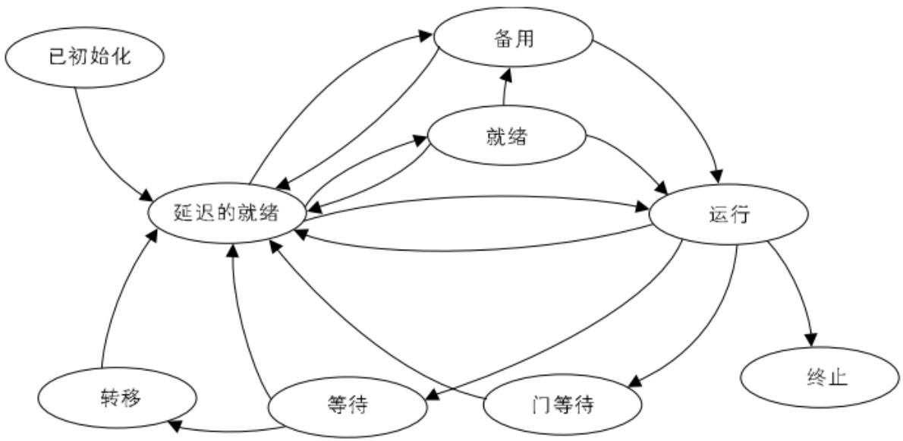
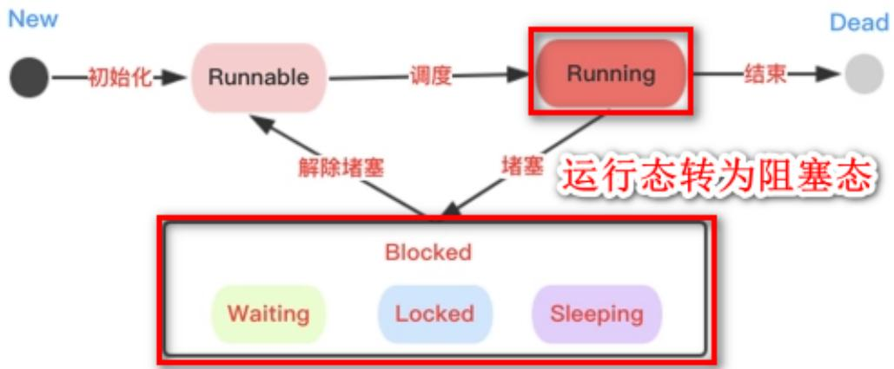
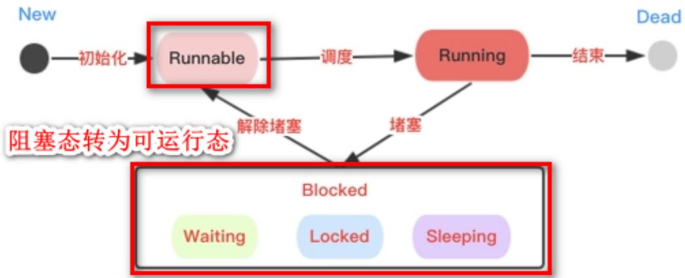
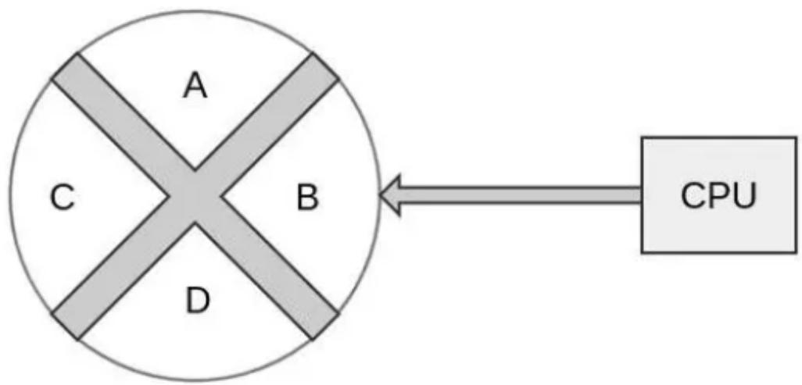
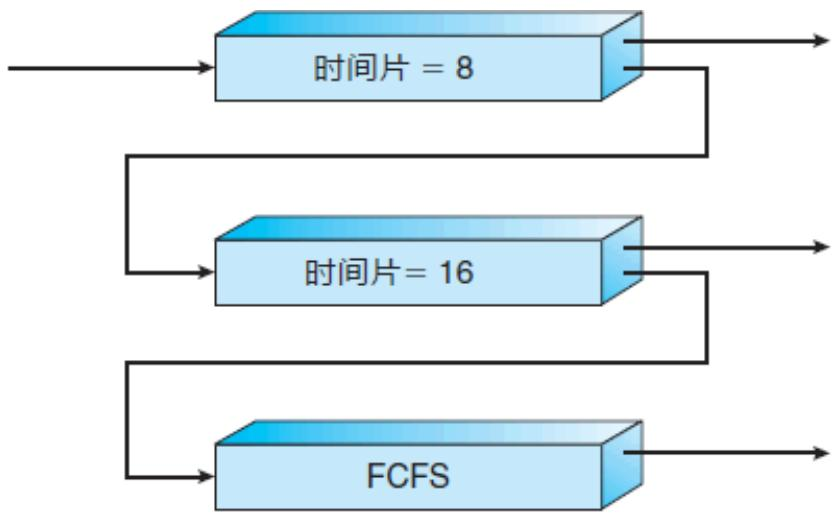

# 操作系统调度算法编程实验

## 实验一、简单ready队列调度算法

### 一、概述

本实验要求同学们在题目提供的C++标准库deque（双端队列）作为ready队列的基础上，按题目要求完成相应函数的代码实现，在本地自测通过后提交到码图系统中，系统自动评分后取得相应题目的分数。通过本实验可帮助同学们理解和掌握操作系统中线程的先到先服务的调度算法的基本原理，同时熟悉码图系统“混合编译型”题目的答题和提交流程。

本实验需完成下列任务：

1. 根据题目要求完成add\_ready\_thread函数，实现向ready队列末尾加入一个处于就绪状态线程结构体对象指针的操作。  
2. 根据题目要求完成schedule函数，实现从ready队列头部取出一个处于就绪状态的线程结构体指针的操作。  
3. 通过题目提供的测试用例，必要时也可自己编写测试用例，验证所写代码的正确性和健壮性。自测无误后提交到码图系统进行自动评测并获得相应的分数。

### 二、实验原理

#### 2-1. 先到先服务（FCFS）调度算法

在非抢占式系统中，先到先服务算法比较自然。使用一个 FIFO（先进先出）队列即可满足要求：所有处于就绪状态的线程构成一个队列，最先进入队列的线程获得处理器执行权，等到放弃处理器执行权时，又回到队列尾部，下一个线程继续执行。新的线程进入到队列时被添加到队列尾部。此算法较为简单且易于实现，但本身性能不佳，一般会作为其他调度算法的局部策略被加以使用。



#### 2-2. deque的使用

在本实验中，我们统一使用C++标准库中的deque容器作为队列使用。



vector容器是单向开口的连续内存空间，deque则是一种双向开口的连续线性空间。所谓的双向开口，意思是可以在头尾两端分别做元素的插入和删除操作，当然，vector容器也可以在头尾两端插入元素，但是在其头部操作效率奇差，无法被接受。

deque容器和vector容器最大的差异，一在于deque允许使用常数项时间对头端进行元素的插入和删除操作。二在于deque没有容量的概念，因为它是动态的以分段连续空间组合而成，随时可以增加一段新的空间并链接起来。换句话说，像vector那样“旧空间不足而重新配置一块更大空间，然后复制元素，再释放旧空间”这样的事情在deque身上是不会发生的。也因此，deque没有必须要提供所谓的空间保留(reserve)功能。

在实际开发中，deque常用操作如下：

size()：取队列中元素的个数  
push\_back(T elem)：向队列尾部添加一个元素  
front()：返回队列头部的一个元素（注意：该操作不将其从队列头部删除）  
pop\_front()：从队列头部弹出一个元素

当需要完成从队列头部取一个元素的操作时，一般首先调用front获取到该元素，然后再调用pop\_front进行弹出。

#### 2-3. 实验程序的模拟思路

本实验为了控制难度，并不需要同学们真的完成线程的上下文切换，而仅仅需要同学们实现调度算法。因此，实验程序中进行了一系列的简化：

##### 1. 简化的线程控制块

同学们在操作系统课程中已经了解和掌握了线程控制块TCB的作用，真实操作系统的线程控制块往往是很复杂的，而本实验由于只需对线程调度算法进行模拟，因此对线程控制块进行了精简。详细的描述请参3-1-1中描述。

##### 2. ready队列

为了控制实验难度，本实验中使用了C++标准库中的deque双端队列作为ready队列，而无需同学们自行实现队列数据结构。详细的描述请参3-1-2中描述。

##### 3. 简化的执行表示

线程获得CPU执行权并正被执行是一个较难描述的过程，在本实验中将其抽象为了一个全局指针current\_thread。当某个线程TCB的指针赋值给current\_thread，在本实验中即代表该线程获得了CPU执行权。详细的描述请参3-1-3中描述。

### 三、设计实现

#### 3-1. 程序说明

请根据要求完成thread\_student.cpp中以下两个函数的代码，并提交到码图系统进行评分。

1. void add\_ready\_thread(thread\* ready\_thread)：向ready队列中添加一个新的线程对象指针。  
2. void schedule()：实现调度算法，按“先到先服务”的算法调度ready队列中的线程，选取合适的线程对象指针放入current\_thread全局变量中。

本实验为了控制难度，并不需要同学们真的完成线程的上下文切换，而仅仅需要同学们实现调度算法。因此，实验程序中进行了一系列的简化。为确保顺利完成实验并获得相应的分数，请仔细阅读以下实验说明：

1. 同学们在操作系统课程中已经学习了进程控制块PCB和线程控制块TCB等概念，在本实验中对其进行了简化。线程控制结构体被简化为了只包含线程ID信息的结构体thread，在头文件thread\_hdr.h中已经定义好了，请同学们不要再重复定义该结构，也不要修改该结构，否则可能导致编译不通过而无法获取到分数。thread\_student.cpp已经包含(include)了thread\_hdr.h头文件，可以直接使用该结构：

```c
typedef struct _thread {
    unsigned int id;
} thread, *pthread; 
```

2. 本题目使用C++标准库中的deque<thread\*>表示ready队列，ready队列已经在测试代码中定义过了，名为ready\_queue，请同学们使用该队列而不要重新定义新的队列，否则可能导致编译不通过而无法获取到分数。thread\_student.cpp已经包含了thread\_hdr.h头文件，可以直接使用该变量：

```rust
typedef std::deque<pthread> thread_queue;
extern thread_queue ready_queue; 
```

3. 本题目使用thread\*类型的全局变量current\_thread表示当前被调度算法选中（即模拟正在被CPU执行的线程）。current\_thread已经在测试代码中定义过了，请同学们不要再在代码中定义了，否则会造成编译不通过。在本题中，同学们将调度算法选中的线程结构的指针赋值给current\_thread即表示算法选中该线程进行执行。

```txt
extern thread* current_thread; 
```

#### 3-2. 测试说明

在完成thread\_student.cpp中的add\_ready\_thread和schedule函数后，大家可以在本地自行测试以下，也可以在thread\_tester代码中自行增加一些测试用例，对一些边界条件和情况进行测试。需要注意的是，这部分测试代码仅用于保证add\_ready\_thread和schedule函数的正确性，在提交到码图评测打分时，不需要提交这部分测试代码。

作为范例，在thread\_tester.cpp中提供了一个基础的测试用例：

```cpp
bool test_two_thread()
{ 
current_thread = NULL;
ready_queue.clear();
// 向ready队列中加入一个线程
thread thread1 = { 1 };
thread thread2 = { 2 };
add_ready_thread(&thread1);
add_ready_thread(&thread2);
// 进行切换时，将current_thread切换为thread1
schedule();
if (current_thread != &thread1 || ready_queue.size() != 1)
{
    return false;
}
// 进行切换时，将current_thread切换为thread1
schedule();
if (current_thread != &thread2 || ready_queue.size() != 1)
{
    return false;
}
return true;
}

int main()
{
bool ret = test_two_thread();
std::cout << ret << std::endl;
return 0;
} 
```

实际在码图测评系统中，包含有更多、更详细的测试用例，如果程序在提交后只拿到部分分数，请注意思考边界条件和细节。

#### 3-3. 提交说明

在提交代码时，请只提交包含如下内容的源文件，不要提交thread\_hdr.h以及thread\_tester.cpp，否则会导致不通过编译而无法得分。若提交后仅拿到部分分数，请仔细阅读题目要求并确认实现细节特别是边界条件。本题提交的代码样例如下：

```c
#include "thread_hdr.h"

void add_ready_thread(thread* ready_thread)
{
    // 相应的代码实现
}

void schedule()
{
    // 相应的代码实现
} 
```

再次强调，在提交代码时，请不要提交thread\_hdr.h以及thread\_tester.cpp中的代码，也不要提交main函数。

## 实验二、引入idle线程和完成语义的线程调度

### 一、概述

在第一个实验中，同学们实现了一个最简单的调度程序，能够按照“先到先服务”的算法将ready队列中的就绪线程调度到current\_thread表示的“当前正在执行线程”上执行。在本实验中，我们将引导同学们在实验一中实现的简单ready队列调度的基础上，继续完善调度程序，通过添加/修改代码的方式接着实现一些新的功能。

本实验需要完成的任务：

1. 引入idle线程的概念，模拟真实操作系统中，当出现ready队列中暂无可调度线程情况时的处理。  
2. 引入线程执行完成的语义，模拟真实操作系统中线程完成任务后退出不再参与调度的情况。

### 二、实验原理

#### 2-1. idle线程

请大家思考下，如果用户没有向操作系统提交任何任务时，ready队列为空，当前系统中没有可供调度的处于ready状态的线程。那么这个时候CPU在做什么呢？

事实上，在计算机工作状态下，CPU需要不断地执行指令。为此操作系统都引入了idle线程的概念，当ready队列中没有线程可调度时则执行idle线程。一旦下一次进行调度时操作系统发现ready队列中有线程等待调度，就会由idle线程的执行切换到ready队列中等待执行的线程进行执行。在现代主流操作系统中，都可以看到与idle线程对等的概念，如Windows中就将其描述为“系统空闲进程”，如下图所示：



在Windows等主流操作系统的实现中，都不将idle线程放入ready队列中，因此我们的模拟实验也遵循了这个要求（同学们在课下可以思考下为什么这么设计？）

#### 2-2. 线程运行结束语义

线程在完成其既定的工作后，应该转为完成状态，在现代操作系统中，都设置有线程运行结束的状态。在操作系统课程中，同学们已经掌握了进程/线程的几种基本状态，在本实验中，我们将对线程的完成状态进行模拟。



事实上，现代操作系统在设计阶段，对于线程的状态往往会进行更为细致和复杂的划分，如Windows操作系统就划分出了9种不同的线程状态，如下图所示。



在本实验中，需要同学们实现“线程运行结束”的语义，我们将在上次实验的代码基础上增加current\_thread\_finished函数。当该函数被调用后，表示当前线程（即current\_thread指针指向的线程）已经完成了任务，不再参与后续调度了。（请大家想一想，为什么线程结束函数只能结束当前线程，如果实现了可以结束其他线程，会不会有什么风险？）

### 三、设计实现

#### 3-1. 程序说明

请根据要求完成thread\_student.cpp中以下三个函数的代码，并提交到码图系统进行评分。

1. void add\_ready\_thread(thread\* ready\_thread)：向ready队列中添加一个新的线程对象指针，该函数本身不发起调度。  
2. void schedule()：实现调度算法，按“先到先服务”的算法调度ready队列中的线程，选取合适的线程对象指针放入current\_thread全局变量中（需要按需完成对idle线程的调度）  
3. void current\_thread\_finished()：current\_thread指向的线程已经完成运行，不再参与后续调度，并且重新发起调度。

本实验同实验一一样，为了控制难度，并不需要同学们真的完成线程的上下文切换，而仅仅需要同学们实现调度算法。因此，实验程序中进行了一系列的简化。为确保顺利完成实验并获得相应的分数，请仔细阅读以下实验说明：

1. （继承至实验一）同学们在操作系统课程中已经学习了进程控制块PCB和线程控制块TCB等概念，在本实验中对其进行了简化。线程控制结构体被简化为了只包含线程ID信息的结构体thread，在头文件thread\_hdr.h中已经定义好了，请同学们不要再重复定义该结构，也不要修改该结构，否则可能导致编译不通过而无法获取到分数。thread\_student.cpp已经包含(include)了thread\_hdr.h头文件，可以直接使用该结构：

```c
typedef struct _thread {
    unsigned int id;
} thread, *pthread; 
```

2. （继承至实验一）本题目使用C++标准库中的deque<thread\*>表示ready队列，ready队列已经在测试代码中定义过了，名为ready\_queue，请同学们使用该队列而不要重新定义新的队列，否则可能导致编译不通过而无法获取到分数。thread\_student.cpp已经包含了thread\_hdr.h头文件，可以直接使用该变量：

```txt
typedef std::deque<pthread> thread_queue; 
```

```txt
extern thread_queue ready_queue; 
```

3. （继承至实验一）本题目使用thread\*类型的全局变量current\_thread表示当前被调度算法选中（即模拟正在被CPU执行的线程）。current\_thread已经在测试代码中定义过了，请同学们不要再在代码中定义了，否则会造成编译不通过。在本题中，同学们将调度算法选中的线程结构的指针赋值给current\_thread即表示算法选中该线程进行执行。

```txt
extern thread* current_thread; 
```

4. （新增要求）本题目中使用thread类型的idle\_thread全局变量表示idle线程。idle\_thread已经在测试代码中定义过了，请同学们不要再在代码中定义了，否则会造成编译不通过。在实现调度算法的过程中，请注意不要将idle\_thread放入ready队列中。根据idle线程的语义，当ready队列中没有可被调度的线程时，则CPU执行idle线程；一旦就绪队列中存在可被调度的线程，则下次调度时会选择该可被调度的线程进行执行。

```vhdl
extern thread idle_thread; 
```

5. （新增要求）本题目需要实现线程完成的语义，该语义对应函数current\_thread\_finished。该函数被调用代表着当前正在被执行的线程（current\_thread指向的线程）已经执行完成，后续不再对其进行调度。需要注意的是，本实验并不要求对这部分已完成运行的线程进行管理。

#### 3-2. 测试说明

在完成thread\_student.cpp中的add\_ready\_thread、schedule和current\_thread\_finished函数后，大家可以在本地自行测试以下，也可以在thread\_tester代码中自行增加一些测试用例，对一些边界条件和情况进行测试。需要注意的是，这部分测试代码仅用于保证add\_ready\_thread、schedule和current\_thread\_finished函数的正确性，在提交到码图评测打分时，不需要提交这部分测试代码。

作为范例，在thread\_tester.cpp中提供了一个基础的测试用例：

```cpp
bool test_three_thread_with_finish()
{
    current_thread = &idle_thread;
    ready_queue.clear();
    // 向ready队列中加入两个线程
    thread thread1 = { 1 };
    thread thread2 = { 2 };
    add_ready_thread(&thread1);
    add_ready_thread(&thread2);
    schedule();    // thread1 is running
    current_thread_finished();    // thread1 finished, thread2 is running
    current_thread_finished();    // thread2 finished
    if (current_thread != &idle_thread)
    {
    return false;
    }
    return true;
}

int main()
{
    bool ret = test_three_thread_with_finish(); 
std::cout << ret << std::endl;
return 0;
} 
```

#### 3-3. 提交说明

在提交代码时，请只提交包含如下内容的源文件，不要提交thread\_hdr.h以及thread\_tester.cpp，否则会导致不通过编译而无法得分。若提交后仅拿到部分分数，请仔细阅读题目要求并确认实现细节特别是边界条件。本题提交的代码样例如下：

```cpp
#include "thread_hdr.h"

void add_ready_thread(thread* ready_thread)
{
    // 相应的代码实现
}

void schedule()
{
    // 相应的代码实现
}

void current_thread_finished()
{
    // 实现的代码
} 
```

再次强调，在提交代码时，请不要提交thread\_hdr.h以及thread\_tester.cpp中的代码，也不要提交main函数。

## 实验三、引入阻塞和唤醒语义的线程调度

### 一、概述

在上一个实验中，同学们已经在实验一的基础上引入了idle线程和线程执行完成的语义，本次实验我们将继续在实验二的基础上完善调度器，实现阻塞和唤醒语义。本实验需要完成的任务：

1. 引入阻塞语义，模拟当前线程在执行时由于遇到I/O、等待等情况下暂时不再参与CPU调度的情况。  
2. 引入唤醒语义中的“唤醒一个”操作，模拟当I/O、等待等操作完成后，该线程可继续参与CPU调度的情况。  
3. 引入唤醒语义中的“唤醒所有”操作，模拟当I/O、等待等操作完成后，所有阻塞线程都可继续参与CPU调度的情况。

### 二、实验原理

#### 2-1. 阻塞语义

当一个线程的控制流到达一个需要等待的操作时，若等待的条件尚不满足，则线程调度器会将处理器的执行权交给其他处于就绪状态的线程。阻塞操作在现代操作系统中是线程状态控制的一个基本语义，当线程在进行磁盘或网络I/O而数据尚未就绪时以及线程同步操作中需要进行等待或暂时未能获取到锁的情况下，线程都会进入阻塞状态，即由运行状态向阻塞状态切换。



在现代操作系统中，通常会有多条阻塞队列，分别设置在不同的需要被等待的IO操作、事件或锁的数据结构上。本实验中为了简化流程，只设置一个全局的等待队列，同学们理解了单等待队列中下的阻塞和唤醒操作之后，对于多个阻塞队列的情况也就能类比进行了。

#### 2-2. 唤醒语义

对于处于阻塞状态的线程，一旦造成其阻塞的条件满足，如磁盘或网络I/O数据就绪或线程同步中该线程等待的信号/事件已满足或其他持有锁的线程对锁进行了释放等操作的情况下，操作系统需要将其唤醒。所谓唤醒，指的是该线程重新变为ready状态并且可以参与到调度中来。在本实验中，由阻塞状态被唤醒的线程依然按照先到先服务的调度算法在ready队列的末尾进行排队。



部分操作系统或者编程语言提供的线程接口还提供了“唤醒所有线程”的功能，即通过调用不同的API，可以实现当等待条件满足时将等待队列中的一个线程加入到ready队列中，或者将阻塞队列中的所有线程都加入到ready队列中。

需要注意的是，在现代操作系统中通常会引入“线程优先级”的概念由阻塞状态被唤醒后的线程往往会被适当地提升优先级，以保证其能在较短的时间之后就能通过调度器获得CPU的执行权。由于本实验尚未涉及到“线程优先级”的概念，因此仍然按照先到先服务的方式，将该线程放入ready队列的队尾即可。

### 三、实验设计

#### 3-1. 程序说明

本实验在实验二（即实现了idle线程和结束语义）的基础上，请同学们根据要求继续完成thread\_student.cpp中以下六个函数的代码，并提交到码图系统进行评分。

1. void add\_ready\_thread(thread\* ready\_thread)：向ready队列中添加一个新的线程对象指针，该函数本身不发起调度。  
2. void schedule()：实现调度算法，按“先到先服务”的算法调度ready队列中的线程，选取合适的线程对象指针放入current\_thread全局变量中（需要按需完成对idle线程的调度）  
3. void current\_thread\_finished()：current\_thread指向的线程已经完成运行，不再参与后续调度，并且重新发起调度。

4. void current\_thread\_blocked()：调用此函数意味着current\_thread指向的线程将处于阻塞态，被加入到阻塞队列中，暂时不再参与后续调度（直到被唤醒），并且重新发起调度。  
5. void notify()：调用此函数意味着从阻塞队列的头部唤醒一个被阻塞的线程  
6. void notify\_all()：调用此函数意味着从阻塞队列唤醒所有被阻塞的线程

本实验同之前的实验一样，为了控制难度，并不需要同学们真的完成线程的上下文切换，而仅仅需要同学们实现调度算法。因此，实验程序中进行了一系列的简化。为确保顺利完成实验并获得相应的分数，请仔细阅读以下实验说明：

1. （继承至实验二）同学们在操作系统课程中已经学习了进程控制块PCB和线程控制块TCB等概念，在本实验中对其进行了简化。线程控制结构体被简化为了只包含线程ID信息的结构体thread，在头文件thread\_hdr.h中已经定义好了，请同学们不要再重复定义该结构，也不要修改该结构，否则可能导致编译不通过而无法获取到分数。thread\_student.cpp已经包含(include)了thread\_hdr.h头文件，可以直接使用该结构：

```c
typedef struct _thread {
    unsigned int id;
} thread, *pthread; 
```

2. （继承至实验二）本题目使用C++标准库中的deque<thread\*>表示ready队列，ready队列已经在测试代码中定义过了，名为ready\_queue，请同学们使用该队列而不要重新定义新的队列，否则可能导致编译不通过而无法获取到分数。thread\_student.cpp已经包含了thread\_hdr.h头文件，可以直接使用该变量：

```rust
typedef std::deque<pthread> thread_queue;
extern thread_queue ready_queue; 
```

3. （继承至实验二）本题目使用thread\*类型的全局变量current\_thread表示当前被调度算法选中（即模拟正在被CPU执行的线程）。current\_thread已经在测试代码中定义过了，请同学们不要再在代码中定义了，否则会造成编译不通过。在本题中，同学们将调度算法选中的线程结构的指针赋值给current\_thread即表示算法选中该线程进行执行。

```txt
extern thread* current_thread; 
```

4. （继承至实验二）本题目中使用thread类型的idle\_thread全局变量表示idle线程。idle\_thread已经在测试代码中定义过了，请同学们不要再在代码中定义了，否则会造成编译不通过。在实现调度算法的过程中，请注意不要将idle\_thread放入ready队列中。根据idle线程的语义，当ready队列中没有可被调度的线程时，则CPU执行idle线程；一旦就绪队列中存在可被调度的线程，则下次调度时会选择该可被调度的线程进行执行。

```vhdl
extern thread idle_thread; 
```

5. （继承至实验二）本题目需要实现线程完成的语义，该语义对应函数current\_thread\_finished。该函数被调用代表着当前正在被执行的线程（current\_thread指向的线程）已经执行完成，后续不再对其进行调度。需要注意的是，本实验并不要求对这部分已完成运行的线程进行管理。  
6. （继承至实验二）add\_ready\_thread的作用仅为向ready队列中添加一个处于就绪状态的线程。调用该函数并不进行线程的调度。  
7. （新增要求）本题目使用C++标准库中的deque<thread\*>表示阻塞队列，阻塞队列已经在测试代码中定义过了，名为blocked\_queue，请同学们使用该队列而不要重新定义新的队列，否则可能导致编译不通过而无法获取到分数。thread\_student.cpp已经包含了thread\_hdr.h头文件，可以直接使用该变量：

```txt
extern thread_queue blocked_queue; 
```

8. (新增要求) 阻塞队列的管理依然采用先到先服务的原则，即被阻塞的线程依次在队尾排队，而从队头取得被唤醒的线程。唤醒单个线程和唤醒所有线程都遵循此规则。

#### 3-2. 测试说明

在完成thread\_student.cpp中的上述六个函数后，大家可以在本地自行测试以下，也可以在thread\_tester代码中自行增加一些测试用例，对一些边界条件和情况进行测试。需要注意的是，这部分测试代码仅用于保证上述六个函数的正确性，在提交到码图评测打分时，不需要提交这部分测试代码。

作为范例，在thread\_tester.cpp中提供了一个基础的测试用例：

```cpp
#include "thread_hdr.h"
#include <iostream>

thread idle_thread = { 0 };

thread_queue ready_queue;

thread_queue blocked_queue;

thread* current_thread = &idle_thread;

bool test_thread_thread_notify_all()
{
    current_thread = &idle_thread;
    ready_queue.clear();
    thread thread1 = { 1 };
    thread thread2 = { 2 };
    thread thread3 = { 3 };
    add_ready_thread(&thread1);
    add_ready_thread(&thread2);
    add_ready_thread(&thread3);

    schedule(); // thread1 is running
    schedule(); // thread2 is running
    schedule(); // thread3 is running

    current_thread_blocked(); // thread3 has been blocked, thread1 is running
    current_thread_blocked(); // thread1 has been blocked, thread2 is running

    notify_all();
    schedule();
    schedule();
    if (current_thread != &thread1)
    {
    return false;
    }

    schedule();
    if (current_thread != &thread2)
    {
    return false;
    }

		return true;
}

int main()
{
    bool ret = test_thread_thread_notify_all();
    std::cout << ret << std::endl;
    return 0;
} 
```

#### 3-3. 提交说明

在提交代码时，请只提交包含如下内容的源文件，不要提交thread\_hdr.h以及thread\_tester.cpp，否则会导致不通过编译而无法得分。若提交后仅拿到部分分数，请仔细阅读题目要求并确认实现细节特别是边界条件。本题提交的代码样例如下：

```cpp
#include "thread_hdr.h"

void add_ready_thread(thread* ready_thread)
{
    // 相应的代码实现
}

void schedule()
{
    // 相应的代码实现
}

void current_thread_finished()
{
    // 相应的代码实现
}

void current_thread_blocked()
{
    // 相应的代码实现
}

void notify()
{
    // 相应的代码实现
}

void notify_all()
{
    // 相应的代码实现
} 
```

再次强调，在提交代码时，请不要提交thread\_hdr.h以及thread\_tester.cpp中的代码，也不要提交main函数。

## 实验四、基于时间片轮转的线程调度

### 一、概述

在上一个实验中，同学们已经基于先到先服务算法设计出了一个功能相对比较齐全的调度器了，此时的调度器已经包含了如下功能：

加入一个处于就绪状态的线程  
实现线程的完成语义  
支持idle线程的调度  
支持阻塞语义  
支持唤醒语义

本实验将引导大家完成一个基于时间片轮转的线程调度算法，该算法是现代操作系统实现的基石。需要注意的是，本实验将在实验三的代码基础上进行修改和增加来完成。

### 二、实验原理

#### 2-1. 时钟中断

从大的分类来讲，调度算法可以分为非抢占式算法和抢占式算法。在非抢占式系统中，一个线程一旦被选择在处理器上运行，就将一直运行下去，直到阻塞（比如等待 I/O 或等待一个信号量）或者自愿放弃或退出。在这类算法中，如果一个线程陷入一个长时间处理甚至无限循环的过程之中，则系统就将无法再运行其他的线程，从而整个系统可能会挂起，因此系统必须有相应的机制来打破这种可能的停滞。在抢占式系统中，一个线程被选中在处理器上运行以后，允许运行的时间长度有最大限制，一旦达到了这么长时间，就将被迫放弃执行权，交由系统挑选其他的线程来运行，或者若找不到其他的线程，则再把执行权交还给它，让它继续运行。抢占式调度算法需要一个时钟中断来获得对处理器的控制权，而非抢占式算法并不需要时钟中断。

时钟中断是操作系统能够进行线程调度的基础，利用时钟中断的周期性特点，操作系统可以实现剥夺式调度算法（抢占式调度算法）。操作系统的调度器组件会在每次时钟中断时被唤醒，暂停正在执行的线程，并根据调度算法和当前正被CPU执行的线程的统计信息决策是否需要进行线程的调度和切换。

从本质上说，时钟中断只是一个周期性的信号，完全是硬件行为，该信号触发CPU去执行一个中断服务程序。为了描述的方便，在很多书籍和文献中就将该服务程序叫做时钟中断。时钟中断对于现代操作系统而言有非常重要的意义，整个操作系统的活动都受到它的激励，系统利用时钟中断维持系统时间、进行时间片轮转的作业（进、线程）调度等。毫不夸张地说，时钟中断是整个操作系统的脉搏。

#### 2-2. 时间片轮转调度

在基于时间片轮转的调度算法中，每个作业占用处理器的时间被分成了最大长度不超过某个值的时间片段，称为时间片。操作系统的调度器组件用轮转的方法将时间片分配给每一个线程。当一个线程获得CPU的执行权以后，按照自身的逻辑执行下去，直到时间片用完，或者自己主动放弃执行权（比如要进行I/O操作或等待一个信号或事件）。



操作系统在时钟中断中获得了处理器控制权以后，用轮转方法找到下一个正在等待运行的线程，让它继续执行。这种线程调度方法实现简单，所有满足运行条件的线程排成一个队列，然后按照时间片的间隔，轮流让每一个线程获得处理器执行权。由于时钟中断每次都要打断一个线程的运行，所以，这种做法存在固有的线程切换开销，而时间片长短的选择会影响到线程切换开销所占的比例。在现代操作系统中，时间片通常设置为几毫秒到几十、上百毫秒。由于现代计算机的指令周期越来越短，线程切换开销也在减小。这种算法使用很广泛，它不仅简单，也确实能公平地分配处理器资源。

### 三、实验设计

#### 3-1. 程序说明

本实验在实验三（即实现了阻塞和唤醒语义）的基础上，请同学们根据要求继续完成thread\_student.cpp中以下六个函数的代码，并提交到码图系统进行评分。

1. void add\_ready\_thread(thread\* ready\_thread)：向ready队列中添加一个新的线程对象指针，该函数本身不发起调度。  
2. void schedule()：实现调度算法，按“先到先服务”的算法调度ready队列中的线程，选取合适的线程对象指针放入current\_thread全局变量中（需要按需完成对idle线程的调度）  
3. void current\_thread\_finished()：current\_thread指向的线程已经完成运行，不再参与后续调度，并且重新发起调度。  
4. void current\_thread\_blocked()：调用此函数意味着current\_thread指向的线程将处于阻塞态，被加入到阻塞队列中，暂时不再参与后续调度（直到被唤醒），并且重新发起调度。  
5. void notify()：调用此函数意味着从阻塞队列的头部唤醒一个被阻塞的线程  
6. void notify\_all()：调用此函数意味着从阻塞队列唤醒所有被阻塞的线程  
7. void on\_clock()：模拟的时钟信号函数，对该函数的调用相当于模拟时钟中断程序被调用  
8. void set\_time\_ticks(unsigned int ticks)：设置时间片

本实验同之前的实验一样，为了控制难度，并不需要同学们真的完成线程的上下文切换，而仅仅需要同学们实现调度算法。因此，实验程序中进行了一系列的简化。为确保顺利完成实验并获得相应的分数，请仔细阅读以下实验说明：

1. （本题目有新增）同学们在操作系统课程中已经学习了进程控制块PCB和线程控制块TCB等概念，在本实验中对其进行了简化。线程控制结构体被简化为了只包含线程ID信息的结构体thread，在头文件thread\_hdr.h中已经定义好了，请同学们不要再重复定义该结构，也不要修改该结构，否则可能导致编译不通过而无法获取到分数。thread\_student.cpp已经包含(include)了thread\_hdr.h头文件，可以直接使用该结构。

本实验中，在TCB中增加了一个字段，用来计量该线程当前的执行时间。

```txt
typedef struct _thread {
    unsigned int id;
    unsigned int clock_times;
} thread, *pthread; 
```

2. （继承至实验三）本题目使用C++标准库中的deque<thread\*>表示ready队列，ready队列已经在测试代码中定义过了，名为ready\_queue，请同学们使用该队列而不要重新定义新的队列，否则可能导致编译不通过而无法获取到分数。thread\_student.cpp已经包含了thread\_hdr.h头文件，可以直接使用该变量：

```rust
typedef std::deque<pthread> thread_queue;
extern thread_queue ready_queue; 
```

3. （继承至实验三）本题目使用thread\*类型的全局变量current\_thread表示当前被调度算法选中（即模拟正在被CPU执行的线程）。current\_thread已经在测试代码中定义过了，请同学们不要再在代码中定义了，否则会造成编译不通过。在本题中，同学们将调度算法选中的线程结构的指针赋值给current\_thread即表示算法选中该线程进行执行。

```txt
extern thread* current_thread; 
```

4. （继承至实验三）本题目中使用thread类型的idle\_thread全局变量表示idle线程。idle\_thread已经在测试代码中定义过了，请同学们不要再在代码中定义了，否则会造成编译不通过。在实现调度算法的过程中，请注意不要将idle\_thread放入ready队列中。根据idle线程的语义，当ready队列中没有可被调度的线程时，则CPU执行idle线程；一旦就绪队列中存在可被调度的线程，则下次调度时会选择该可被调度的线程进行执行。

```vhdl
extern thread idle_thread; 
```

5. （继承至实验三）本题目需要实现线程完成的语义，该语义对应函数current\_thread\_finished。该函数被调用代表着当前正在被执行的线程（current\_thread指向的线程）已经执行完成，后续不再对其进行调度。需要注意的是，本实验并不要求对这部分已完成运行的线程进行管理。

6. （继承至实验三）add\_ready\_thread的作用仅为向ready队列中添加一个处于就绪状态的线程。调用该函数并不进行线程的调度。

7. （继承至实验三）本题目使用C++标准库中的deque<thread\*>表示阻塞队列，阻塞队列已经在测试代码中定义过了，名为blocked\_queue，请同学们使用该队列而不要重新定义新的队列，否则可能导致编译不通过而无法获取到分数。thread\_student.cpp已经包含了thread\_hdr.h头文件，可以直接使用该变量：

```txt
extern thread_queue blocked_queue; 
```

8. (继承至实验三) 阻塞队列的管理依然采用先到先服务的原则，即被阻塞的线程依次在队尾排队，而从队头取得被唤醒的线程。唤醒单个线程和唤醒所有线程都遵循此规则。

9. （本实验新增）本实验中的调度器新增了一个名为on\_clock的函数，该函数用于模拟时钟中断。测试代码将周期性地调用该函数，模拟时钟中断被周期性地触发。该函数两次调用之间的时间间隔即为一个时钟周期（单位时间），单位时间由set\_time\_interval设定。

```c
void set_time_interval(unsigned int interval); // 设置时钟中断触发一次对应的时间增量
void on_clock(); // 模拟时钟中断，该函数会被测试代码调用，每调用一次相当于经过了set_time_interval设定的时隙
```

10. （本实验新增）本实验中的调度器新增了set\_time\_ticks接口，设置每个线程的最长执行时间（即时间片）。当时钟中断到来时，调度器给当前正执行的线程加上相应的时隙后，判断其本次执行时长是否大于时间片，若大于则强制发起切换（调用schedule函数）。

```c
void set_time_ticks(unsigned int ticks); // 设置时间片
```

#### 3-2. 测试说明

在完成thread\_student.cpp中的上述函数后，大家可以在本地自行测试以下，也可以在thread\_tester代码中自行增加一些测试用例，对一些边界条件和情况进行测试。需要注意的是，这部分测试代码仅用于保证上述函数的正确性，在提交到码图评测打分时，不需要提交这部分测试代码。

作为范例，在thread\_tester.cpp中提供了一个基础的测试用例：

```cpp
#include "thread_hdr.h"
#include <iostream>

thread idle_thread = { 0 };

thread_queue ready_queue;

thread_queue blocked_queue;

thread* current_thread = &idle_thread;

bool test_multi_thread()
{
    ready_queue.clear();
    set_time_ticks(40);
    set_time_interval(20);
    current_thread = &idle_thread;

    thread thread1 = { 1 };
    thread thread2 = { 2 };
    thread thread3 = { 3 };
    add_ready_thread(&thread1);
    add_ready_thread(&thread2);
    add_ready_thread(&thread3);

    on_clock();
    on_clock();
    on_clock();
    on_clock();
    if (current_thread != &thread2)
    {
    return false;
    }

    on_clock();
    on_clock();
    if (current_thread != &thread3)
    {
    return false;
    }

    return true;
}

int main()
{
    bool ret = test_multi_thread();
    std::cout << ret << std::endl;
    return 0;
} 
```

#### 3-3. 提交说明

在提交代码时，请只提交包含如下内容的源文件，不要提交thread\_hdr.h以及thread\_tester.cpp，否则会导致不通过编译而无法得分。若提交后仅拿到部分分数，请仔细阅读题目要求并确认实现细节特别是边界条件。本题提交的代码样例如下：

```c
#include "thread_hdr.h"

void add_ready_thread(thread* ready_thread)
{
    // 相应的代码实现
}

void schedule()
{
    // 相应的代码实现
}

void current_thread_finished()
{
    // 相应的代码实现
}

void current_thread_blocked()
{
    // 相应的代码实现
}

void notify()
{
    // 相应的代码实现
}

void notify_all()
{
    // 相应的代码实现
}

void on_clock()
{
    // 相应的代码实现
}

void set_time_ticks(unsigned int ticks)
{
    // 相应的代码实现
}

void set_time_interval(unsigned int interval)
{
    // 相应的代码实现
} 
```

再次强调，在提交代码时，请不要提交thread\_hdr.h以及thread\_tester.cpp中的代码，也不要提交main函数。

## 实验五、多级反馈队列调度算法

### 一、概述

在之前的实验中，同学们先后实现了先到先服务的调度算法以及基于时间片轮转的调度算法。本节我们将在上述算法的基础上，继续实现多级反馈队列调度算法。该算法也是很多现代操作系统调度算法的雏形。需要注意的是，本实验将在实验四的代码基础上进行修改和增加来完成。

### 二、实验原理

#### 2-1. 多级反馈队列调度算法

多级反馈队列调度算法是一种CPU处理机调度算法，该算法无需事先知晓或估计各进/线程所需要的执行时间，同时可以较好地满足各种类型进/线程的需要，是目前公认的一种较好的进程调度算法。

该算法设置有多个就绪队列，不同的就绪队列对于CPU的优先级是不一样的，也就是说位于各个队列中的作业（进/线程）的优先级也是不一样的。假定就绪队列名称依次为Q1、Q2...Qn，则从Q1到Qn队列的优先级依次降低。如位于Q1中的任何一个作业都要比Q2中的任何一个作业相对于CPU的优先级要高（即Q1中的作业一定要比Q2中的作业先被处理机调度）。各队列在队内遵循基于时间片轮转的调度算法，但不同队列中的任务所分配的时间片随着优先级的增加而减少的，即优先级越高的队列中作业的时间片就越短。



#### 其具体描述如下：

1. 进程在进入待调度的队列等待时，首先进入优先级最高的Q1等待。  
2. 首先调度优先级高的队列中的进程。若高优先级中队列中已没有调度的进程，则调度次优先级队列中的进程。例如：Q1,Q2,Q3三个队列，只有在Q1中没有进程等待时才去调度Q2，同理，只有Q1,Q2都为空时才会去调度Q3。  
3. 对于同一个队列中的各个进程，按照时间片轮转法调度。如Q1队列中的作业在经历了设定的时间片后将继续进入Q2队列等待，若该作业在Q2队列设定的时间片用完后作业还不能完成，则继续进入下一级队列（如果有的话）直至完成。  
4. 在低优先级的队列中的进程在运行时，又有新到达的作业，那么在下一个时钟周期到达后，CPU马上分配给新到达的作业。

### 三、实验设计

#### 3-1. 程序说明

本实验在实验四的基础上实现具有两级反馈队列的调度算法，请同学们根据要求继续完成thread\_student.cpp中以下六个函数的代码，并提交到码图系统进行评分。

1. void add\_ready\_thread(thread\* ready\_thread)：向第一级ready队列中添加一个新的线程对象指针，该函数本身不发起调度。  
2. void current\_thread\_finished()：current\_thread指向的线程已经完成运行，不再参与后续调度，并且重新发起调度。  
3. void current\_thread\_blocked()：调用此函数意味着current\_thread指向的线程将处于阻塞态，被加入到阻塞队列中，暂时不再参与后续调度（直到被唤醒），并且重新发起调度。  
4. void notify()：调用此函数意味着从阻塞队列的头部唤醒一个被阻塞的线程，并将其加入到第一级ready队列  
5. void notify\_all()：调用此函数意味着从阻塞队列唤醒所有被阻塞的线程，并按次序依次加入到第一级ready队列  
6. void on\_clock()：模拟的时钟信号函数，每次对该函数的调用相当于模拟时钟中断程序被调用  
7. void set\_first\_time\_ticks(unsigned int ticks); // 设置第一级Ready队列中作业的最长时间片void set\_second\_time\_ticks(unsigned int ticks); // 设置第二级Ready队列中作业的最长时间片

本实验同之前的实验一样，为了控制难度，并不需要同学们真的完成线程的上下文切换，而仅仅需要同学们实现调度算法。因此，实验程序中进行了一系列的简化。为确保顺利完成实验并获得相应的分数，请仔细阅读以下实验说明：

1. （本实验新增）本题目需要同学们实现两级ready队列。两级ready队列都已经在测试代码中定义过了，请同学们使用该队列而不要重新定义新的队列，否则可能导致编译不通过而无法获取到分数。thread\_student.cpp已经包含了thread\_hdr.h头文件，可以直接使用相应的全局变量。

```txt
thread_queue first_ready_queue;
thread_queue second_ready_queue; 
```

2. （本实验新增）本题目不再对schedule函数进行统一要求。事实上，从实验四开始就是由时钟中断触发调度语义，但由于实验四中schedule的语义可以被其它函数引用，因此暂时将其保留。在本题目中，同学们需要仔细考虑自己在之前实验中实现的schedule函数在引入多级ready队列后代码中是否适用。如不适用，可以将其逻辑分散到合适的位置；如果依然适用，亦可以保留。  
3. （本实验新增）在本实验中，在TCB线程控制块字段中增加了一个名为max\_clock\_times的字段供同学们使用。max\_clock\_times可用于存储该线程当前所能运行的时间片上限。当然，该字段不是必须要使用的，如果同学们的算法本身无需使用到该字段，则可以忽略掉该字段。

```c
typedef struct _thread {
    unsigned int id;
    unsigned int clock_times;
    unsigned int max_clock_times;
} thread, *pthread; 
```

4. （本实验新增）本实验中的调度器新增了set\_first\_time\_ticks以及set\_second\_time\_ticks接口，设置作业在该队列的最长执行时间（即时间片）。当时钟中断到来时，调度器给当前正执行的线程加上相应的时隙后，判断其本次执行时长是否大于等于相应的时间片，若大于等于则强制发起切换。

```cpp
void set_first_time_ticks(unsigned int ticks); // 设置第一级Ready队列中作业的最长时间片
void set_second_time_ticks(unsigned int ticks); // 设置第二级Ready队列中作业的最长时间片
```

#### 3-2. 测试说明

在完成thread\_student.cpp中的上述函数后，大家可以在本地自行测试以下，也可以在thread\_tester代码中自行增加一些测试用例，对一些边界条件和情况进行测试。需要注意的是，这部分测试代码仅用于保证上述函数的正确性，在提交到码图评测打分时，不需要提交这部分测试代码。

作为范例，在thread\_tester.cpp中提供了一个基础的测试用例：

```cpp
#include "thread_hdr.h"
#include <iostream>

thread idle_thread = { 0 };

thread_queue first_ready_queue;
thread_queue second_ready_queue;

thread_queue blocked_queue;

thread* current_thread = &idle_thread;

void _common_init()
{
    first_ready_queue.clear();
    second_ready_queue.clear();
    blocked_queue.clear();
    set_time_interval(20);
    set_first_time_ticks(40);
    set_second_time_ticks(60);
    current_thread = &idle_thread;
}

bool _is_valid_status(
    pthread target_thread,
    unsigned int first_queue_size,
    unsigned int second_queue_size
)
{
    if (current_thread != target_thread ||
    first_ready_queue.size() != first_queue_size ||
    second_ready_queue.size() != second_queue_size)
    {
    return false;
    }
    return true;
}

bool test_simple_thread_with_block()
{
    _common_init();

    thread thread1 = { 1 };
    thread thread2 = { 2 };
    add_ready_thread(&thread1);
    add_ready_thread(&thread2);

    for (int i = 0; i < 2; i++)
    { 
        on_clock();
        if (!_is_valid_status(&thread1, 1, 0))
        {
            return false;
        }
    }

    on_clock();
    if (!_is_valid_status(&thread2, 0, 1))
    {
        return false;
    }

    current_thread_blocked();
    if (!_is_valid_status(&thread1, 0, 0))
    {
        return false;
    }
    notify_all();
    on_clock();
    if (!_is_valid_status(&thread2, 0, 1))
    {
        return false;
    }
    return true;
}

int main()
{
    bool ret = test_simple_thread_with_block();
    std::cout << ret << std::endl;
    return 0;
} 
```

### 四、提交说明

在提交代码时，请只提交包含如下内容的源文件，不要提交thread\_hdr.h以及thread\_tester.cpp，否则会导致不通过编译而无法得分。若提交后仅拿到部分分数，请仔细阅读题目要求并确认实现细节特别是边界条件。本题提交的代码样例如下：

```c
#include "thread_hdr.h"

void add_ready_thread(thread* ready_thread)
{
    // 相应的代码实现
}

void current_thread_finished()
{
    // 相应的代码实现
}

void current_thread_blocked()
{
    // 相应的代码实现
} 

void notify()
{
    // 相应的代码实现
}

void notify_all()
{
    // 相应的代码实现
}

void on_clock()
{
    // 相应的代码实现
}

void set_first_time_ticks(unsigned int ticks)
{
    // 相应的代码实现
}

void set_second_time_ticks(unsigned int ticks)
{
    // 相应的代码实现
}

void set_time_interval(unsigned int interval)
{
    // 相应的代码实现
} 
```
