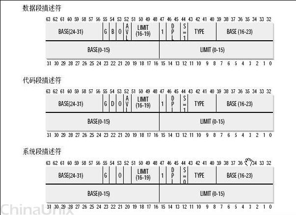
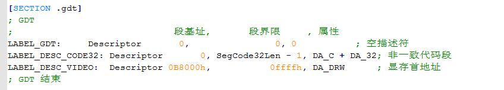
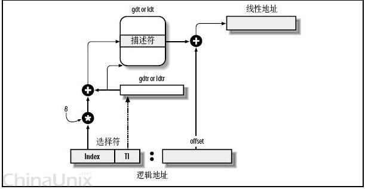
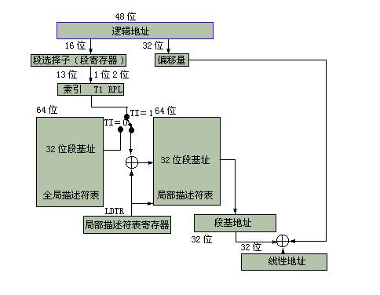
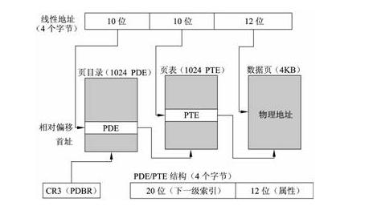

# **实验三 虚拟内存综合实验** 

**实验所属系列：《计算机操作系统》                实验对象： 本科**

**相关课程及专业：计算机操作系统，C，数据结构    实验时数（学分）： 4学时**

**【实验目的】**

通过实验，掌握段页式内存管理机制，理解地址转换的过程

**【实验内容】**

通过手工查看系统内存，并修改特定物理内存的值，实现控制程序运行的目的

**【实验环境】**

Linux 内核（0.11）+ Bochs

**【实验参考步骤】**

1. 编写 实验使用的示例程序:

#include <stdio.h>

int j = 0x123456;

int main()

{

printf("the address of j is 0x%x\n", &j);

while(j);

printf("program terminated normally!\n");

return 0;

}

2. 理解X86计算机的寻址机制，理解全局描述符表GDT，局部描述符表等数据结构的内容。

3  查看GDTR，LDTR，DS等寄存器，了解寄存器的数据格式。

4. 根据寄存器和相关的数据结构，计算变量j的线性地址。

5. 使用creg查看寄存器信息

6. 根据线性地址和页内偏移，基于页式地址转换，计算物理地址。

**【实验预备知识】**

**关于计算机中的地址**

**（一）物理地址，线性地址，逻辑地址，虚拟地址。**

**物理地址：**

物理地址最好理解，我们可以简单的把内存比作一个大的数组（为了分析方便），每个数组都有其下标，这个下标标识了内存中的地址，这个实实在在的在内存中的地址，我们称之为物理地址。但是在用于内存芯片级的单元寻址，与处理器和CPU连接的地址总线相对应，相信并不是一个所谓的数组，但是做出这样的比拟，有利于更好的理解。

还依稀记得这张图：

**逻辑地址：**

与物理地址比较相对的是逻辑地址，实际上这个概念，我觉得可以这样理解，这个地址就是在程序中我们把它放到的位置；而这个位置通常是由编译器给出的。另外的一种理解是：逻辑地址指的是机器语言指令中，用来指定一个操作数或者是一条指令的地址。Intel段式管理中：，“一个逻辑地址，是由一个段标识符加上一个指定段内相对地址的偏移量，表示为 [段标识符：段内偏移量]。”比如我们在程序中定义一个变量 int g=3；相应的汇编代码应该是mov [g],3;那么这个g应该放在哪儿呢？实际上我们可以看到，这个g的地址总在在编译，链接之后就会一个确定的地址;而这个确定的地址我们叫做逻辑地址。

**虚拟地址：**

Virtual Address，简称VA，由于Windows程序时运行在386保护模式下，这样程序访问存储器所使用的逻辑地址称为虚拟地址。实际上因为我们现代程序中地址都是虚拟的，所以这里的虚拟地址和线性地址是等价了的。

**线性地址:** 线性地址（Linear Address）也叫虚拟地址(virtual address)是逻辑地址到物理地址变换之间的中间层。在分段部件中逻辑地址是段中的偏移地址，然后加上基地址就是线性地址。

**（二）CPU段式内存管理：逻辑地址转换为线性地址；**

一个逻辑地址由两部份组成，段标识符: 段内偏移量。段标识符是由一个16位长的字段组成，称为段选择符。其中前13位是一个索引号。后面3位包含一些硬件细节：

最后两位涉及权限检查。

索引号，或者直接理解成数组下标——那它总要对应一个数组，它应该是指向一个东西的？而这个东西就是“段描述符(segment descriptor)”，呵呵，段描述符具体地址描述了一个段。这样，很多个段描述符，就组了一个数组，叫“段描述符表”，这样，可以通过段标识符的前13位，直接在段描述符表中找到一个具体的段描述符，这个描述符就描述了一个段，每一个段描述符由8个字节组成，如下图：

而在汇编里面我们用一个数据结构这样定义：

Base字段，它描述了一个段的开始位置的线性地址。

Intel设计是，一些全局的段描述符，就放在“全局段描述符表(GDT)”中，一些局部的，例如每个进程自己的，就放在所谓的“局部段描述符表(LDT)”中。那究竟什么时候该用GDT，什么时候该用LDT呢？这是由段选择符中的T1字段表示的，=0，表示用GDT，=1表示用LDT。

GDT在内存中的地址和大小存放在CPU的gdtr控制寄存器中，而LDT则在ldtr寄存器中。具体如下图：

首先，给定一个完整的逻辑地址[段选择符：段内偏移地址]

1、看段选择符的T1=0还是1，知道当前要转换是GDT中的段，还是LDT中的段，再根据相应寄存器，得到其地址和大小。我们就有了一个数组了。

2、拿出段选择符中前13位，可以在这个数组中，查找到对应的段描述符，这样，它了Base，即基地址就知道了。

3、把Base + offset，就是要转换的线性地址了。对于软件来讲，原则上就需要把硬件转换所需的信息准备好，就可以让硬件来完成这个转换了。

但是实际的情况并不是这么简单：linux和windows的做法貌似是不同的。

**2.CPU的页式内存管理**

CPU的页式内存管理单元，负责把一个线性地址，最终翻译为一个物理地址。从管理和效率的角度出发，线性地址被分为以固定长度为单位的组，称为页，例一个32位的机器，线性地址最大可为4G，可以用4KB为一个页来划分，这页，整个线性地址就被划分为一个tatol\_page[2^20]的大数组，共有2的20个次方个页。这个大数组我们称之为页目录。目录中的每一个目录项，就是一个地址——对应的页的地址。

另一类“页”，我们称之为物理页，或者是页框、页桢的。是分页单元把所有的物理内存也划分为固定长度的管理单位，它的长度一般与内存页是一一对应的。这里注意到，这个total\_page数组有2^20个成员，每个成员是一个地址（32位机，一个地址也就是4字节），那么要单单要表示这么一个数组，就要占去4MB的内存空间。为了节省空间，引入了一个二级管理模式的机器来组织分页单元。看图：

描述：1、分页单元中，页目录是唯一的，它的地址放在CPU的cr3寄存器中，是进行地址转换的开始点。万里长征就从此长始了。

2、每一个活动的进程，因为都有其独立的对应的虚似内存（页目录也是唯一的），那么它也对应了一个独立的页目录地址。——运行一个进程，需要将它的页目录地址放到cr3寄存器中，将别个的保存下来。

3、每一个32位的线性地址被划分为三部份，面目录索引(10位)：页表索引(10位)：偏移(12位)

转换步骤：

1、从cr3中取出进程的页目录地址（操作系统负责在调度进程的时候，把这个地址装入对应寄存器）；

2、根据线性地址前十位，在数组中，找到对应的索引项，因为引入了二级管理模式，页目录中的项，不再是页的地址，而是一个页表的地址。（又引入了一个数组），页的地址被放到页表中去了。

3、根据线性地址的中间十位，在页表（也是数组）中找到页的起始地址；

4、将页的起始地址与线性地址中最后12位相加，得到最终我们想要的物理地址；