## **Linux寻址实验**

## **薛瑞尼**

## **计算机科学与工程学院**

## **2021/11/20**

## **要求**

- 【实验目的】
    - 通过实验，掌握段页式内存管理机制，理解地址转换的过程
- 【实验内容】
    - 通过手工查看系统内存，并修改特定物理内存的值，实现控制程序运行的目的
- 【实验环境】
    - Linux 内核（0.11）+ Bochs

## **实验验证**

- 直接修改物理地址中的值，以结束死循环

#include <stdio.h>

int j = 0x123456;

int main()

{

printf("the address of j is 0x%x\n", &j);

while(j);

printf("Hey, you got it!\n");

return 0;

}

## **原理知识**

- 地址结构 48bit: 16+32
- 线性地址（真正的逻辑地址）
- GDT/LDT概念
- 段描述符结构
- CR0/CR3用法
- Page Directory Entry/Page Table Entry结构：20bit base + 12属性。

## **Intel IA-32**

- 段页式：段<4G；段数<16K。

- 逻辑地址格式: 48bit (selector:16, offset:32)
- Selector
    - s: 段号; g: GDT/LDT; p: 权限

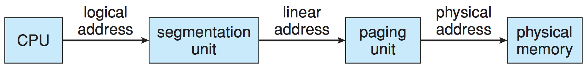

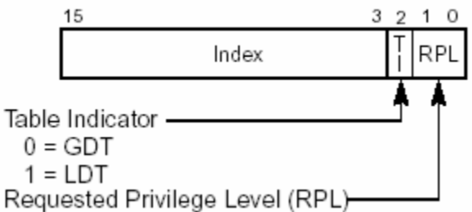

## **段选择符寄存器**

- 保护模式下CS、DS、SS、ES、FS、GS寄存器称为段选择符寄存器，其值不再是基址而是选择符，它从描述符表中选择一个定义存储器段大小和属性的描述符
- FS/GS用于OS进行数据通信。
- 实验数据：DS

## **IA-32 Segmentation**

- 每个进程两类段：
    - **LDT(local descriptor table): private segmentations  LDTR**
    - **GDT(global): public segmentations  GDTR**
    - Entry: segmentation descriptor (8B): base+limit

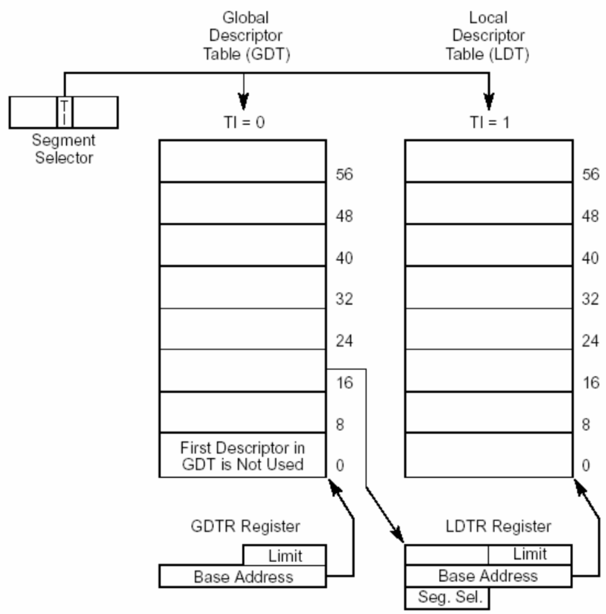

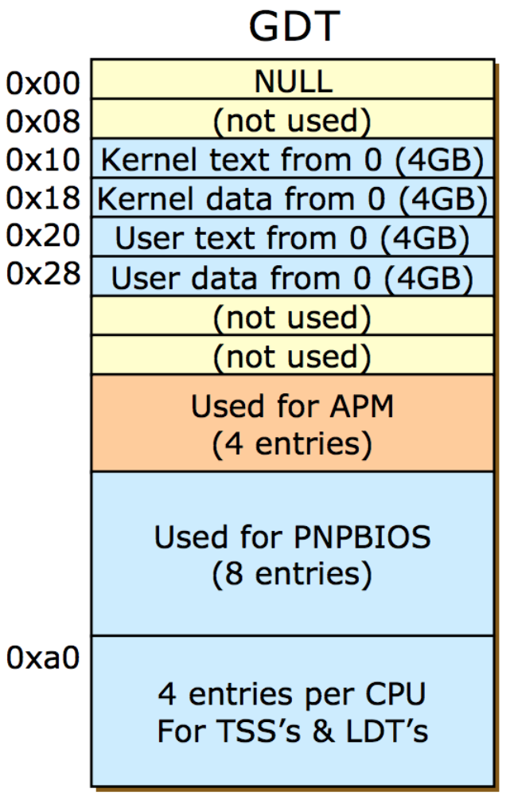

## **描述符(Descriptor)**

- 描述存储器“段”的属性的一个8字节的数据结构。
- 两种类型
    - 段描述符：用于描述代码、数据和堆栈段
    - 系统段描述符：中断描述符、任务段等

## **段描述符**

- **G位(粒度位)：**
    - **G=0, 段的长度以字节为单位**
        - **段长最大1M字节**
    - **G=1,段的长度以页(4K字节)为长度单位**
        - **段长最大1M4K=4G字节**

- **D位**
    - **D=0，16位指令方式**
    - **D=1，32位指令方式**
- **AVL位：**
    - **AVL=0，程序不可使用本段**
    - **AVL=1，程序可以使用本段**

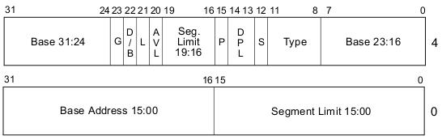

## **全局描述符表寄存器GDTR**

### **在物理存储器地址空间中定义全局描述符表GDT**

### **47**

### **GDTR**

### **16**

### **BASE（32位）**

### **15**

### **LIMIT**

### **0**

### **BASE指示GDT在物理存储器中开始的位置**

### **LIMIT规定GDT的界限**

### **LIMIT有16位，从而GDT最大65536个字节，**

### **能够容纳65536/8=8192个描述符**

## **局部描述符表寄存器LDTR**

- 16位的LDTR并不直接定义LDT，它只是一个指向GDT中LDT描述符的选择符（segmentation selector – 16bit）。
- 如果LDTR中装入了选择符，相应的描述符将从GDT中读出段LDT描述符（Base+limit）
- LDT定义任务用到的局部存储器地址空间

## **GDT/LDT/GDTR/LDTR关系**

**GDTR**

**BASE**

**LIMIT**

**LDT描述符**

**GDT**

**LDTR**

**32位**

**基址**

**LDT描述符高速缓冲**

**寄存器（不可见）**

**16位**

**界限**

**LDT**

## **GDT/LDT的工作过程**

- 给定逻辑地址a:b
- 根据逻辑地址的a（段选择符）的TI位确定是选择GDT还是LDT。
    - T1=0选GDT，根据GDTR找到GDT的基址，根据a的 3\~15位确定它的段描述符X在GDT中的位置（GDTR即基址+a的3-15bit即相对位置）：确定段描述符X，再根据段描述符提取出其中包含的段基址信息，段基址+b（段内偏移），最终确定线性地址。
    - T1=1选LDT。根据GDTR找到GDT的基址，根据LDTR（此时为segment selector）高13位确定它的LDTX描述符在GDT中的位置。LDTX描述符可确定LDT基址，再根据段选择符a确定的相对位置，可以确定LDT中的私有段描述符Y。再根据段描述符提取出其中包含的段基址信息，段基址+b（段内偏移），最终确定线性地址。

## **逻辑地址线性地址**

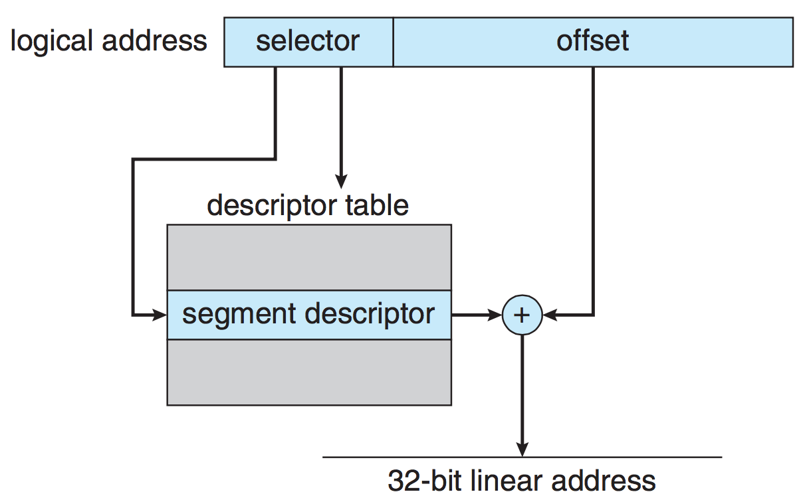

## **IA-32 Paging**

- Page size: 4KB 或 4MB
- 4KB: 二级页表
- 4MB: 一级页表
- 4B：PTE
- **CR0:首位表示PG**
- **CR3**: physical address of  the current page directory  (a.k.a. page directory base  register or **PDBR**)

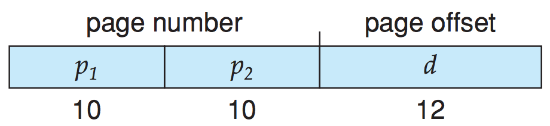

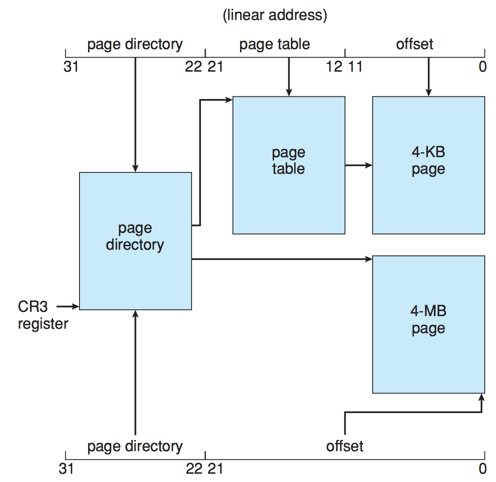

## **控制寄存器**

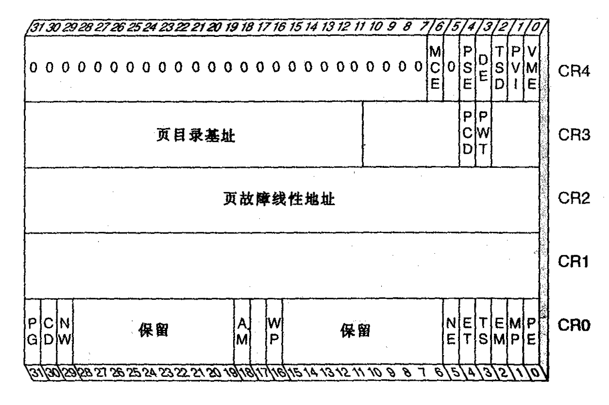

## **完整的address translation**

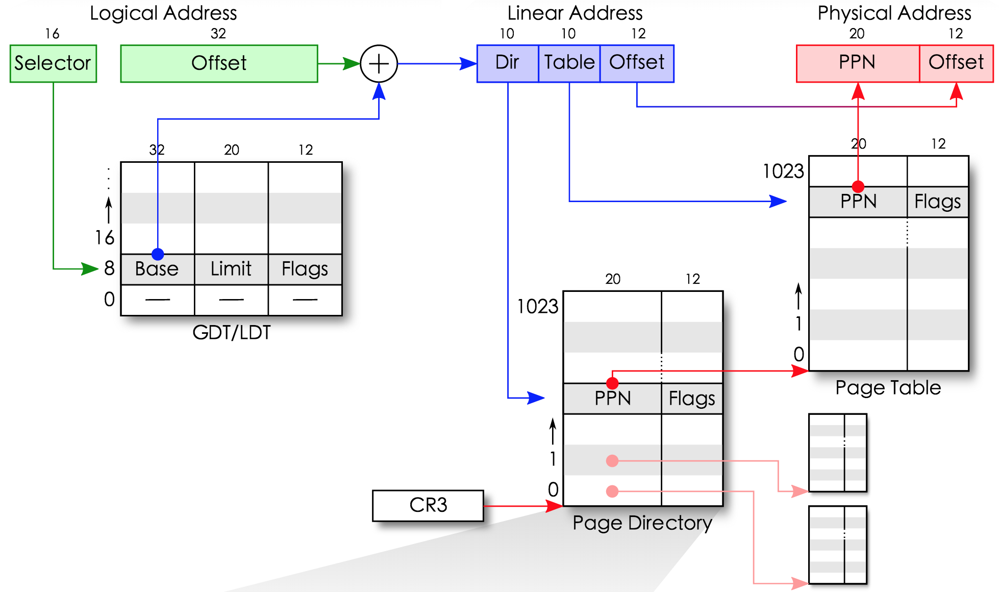

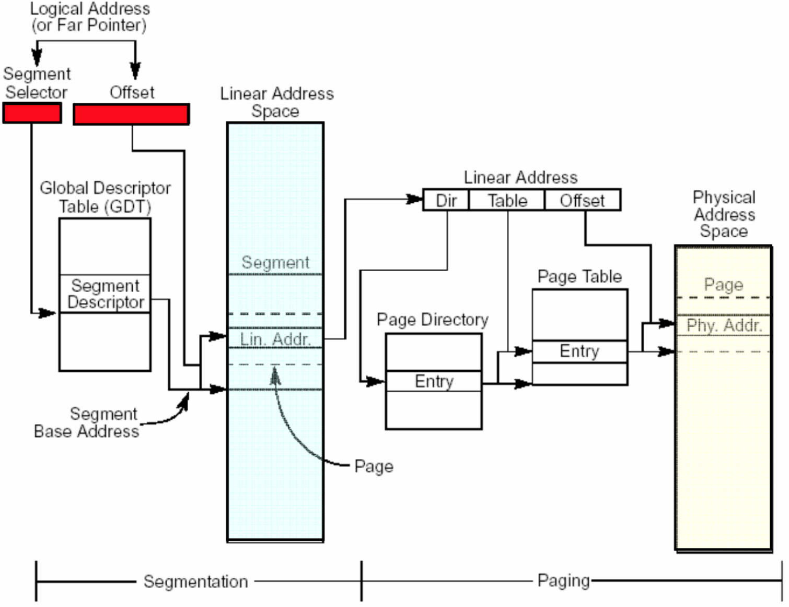

## **Page Directory/Table entry**

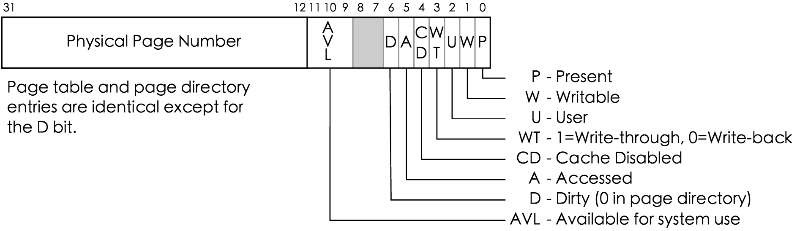

取到页表项之后只要高20位，低12位补0

## **小结**

- Selector, descriptor, PE
- 总流程
    1. edit the configure: use absolute path
    2. bochs -f configfile
    3. 两个界面
    4. 主要命令
        - c: continue
        - xp: byte, word (4-bytes)
            - 大小端
        - sreg
        - creg
        - setpmem
        - help

    5. press c to boot
    6. 创建c程序
    7. 编译: gcc a.c
    8. 运行 ./a.out
    9. 打印出来的是 ds 段内偏移 0x3004
    10. in console: ctrl + c
    11. **your major work**
    12. press c

----

1. 查表计算偏移注意长度
    1. GDT/LDT: 8Byte
    2. PE: 4Byte
