# Linux 0.11 地址映射实验报告草稿

## 一、实验目的

本实验通过在 Bochs 中运行 Linux 0.11，观察并手工推导一个用户态变量从逻辑地址到物理地址的转换过程，理解 IA-32 保护模式下段式管理和页式管理的配合方式。实验最终通过直接修改变量 `j` 所在的物理内存，使测试程序跳出 `while(j)` 死循环，验证地址转换结果。

## 二、实验环境

- 主机系统：macOS
- 模拟器：Homebrew 安装的 Bochs 3.0
- 客体系统：Linux 0.11
- 实验镜像：
  - `lab2-linux-bochs/bootimage-0.11-hd`
  - `lab2-linux-bochs/diska.img`
  - `lab2-linux-bochs/hdc-0.11-new.img`
- 配置文件：`mybochsrc-hd.bxrc`

### macOS 配置适配

原配置文件由 Windows 版 Bochs 生成，包含 `win32config`、`display_library: win32`、`C:\Program Files...` 和 `.\` 相对路径等 Windows 专用内容。在 macOS 上需要做如下调整：

1. 将配置界面改为文本界面：

   ```text
   config_interface: textconfig
   ```

2. 将显示后端改为 Homebrew Bochs 可用的 SDL2：

   ```text
   display_library: sdl2
   ```

3. 使用 Bochs 内置变量 `$BXSHARE` 指向 Homebrew 安装目录下的 BIOS 文件：

   ```text
   romimage: file=$BXSHARE/BIOS-bochs-latest, options=fastboot
   vgaromimage: file=$BXSHARE/VGABIOS-lgpl-latest.bin
   ```

4. 将软盘和硬盘镜像路径改为 macOS 绝对路径，避免从不同工作目录启动 Bochs 时找不到镜像。

5. 删除旧配置中的 `gameport` 插件加载项。Homebrew Bochs 3.0 当前插件目录中没有该插件，保留 `gameport=1` 会导致 Bochs 启动时报错。

6. 将旧配置中的 CPU 写法改为 Bochs 3.0 支持的预定义模型，并删除实验不需要的旧设备禁用项：

   ```text
   cpu: model=pentium, count=1, ips=4000000, reset_on_triple_fault=1, ignore_bad_msrs=1
   ```

启动命令：

```bash
bochs -q -f mybochsrc-hd.bxrc -debugger
```

其中 `-debugger` 用于进入 Bochs 内部调试器，便于执行 `sreg`、`creg`、`xp`、`setpmem` 等命令。

## 三、实验程序

实验使用如下 C 程序。变量 `j` 初值非零，因此程序会停留在 `while(j)` 循环中；若能通过 Bochs 修改 `j` 对应的物理内存为 `0`，程序即可继续执行并正常结束。

```c
#include <stdio.h>

int j = 0x123456;

int main()
{
    printf("the address of j is 0x%x\n", &j);
    while (j);
    printf("program terminated normally!\n");
    return 0;
}
```

## 四、实验原理

IA-32 保护模式下，程序看到的地址需要经过两级转换：

1. 逻辑地址到线性地址：由段选择符和段内偏移组成逻辑地址。段选择符指向 GDT 或 LDT 中的段描述符，处理器从描述符中取出段基址，再加上段内偏移得到线性地址。
2. 线性地址到物理地址：开启分页后，CR3 保存页目录的物理基地址。32 位线性地址被划分为页目录索引、页表索引和页内偏移。通过页目录项和页表项找到物理页框，再加页内偏移得到最终物理地址。

本实验中，测试程序打印出的 `&j` 是变量 `j` 在当前数据段内的偏移。需要结合 DS、LDTR、GDT/LDT 描述符、CR3、页目录项和页表项逐步推导出它的物理地址。

## 五、实验步骤

1. 使用适配后的配置文件启动 Bochs：

   ```bash
   bochs -q -f mybochsrc-hd.bxrc -debugger
   ```

   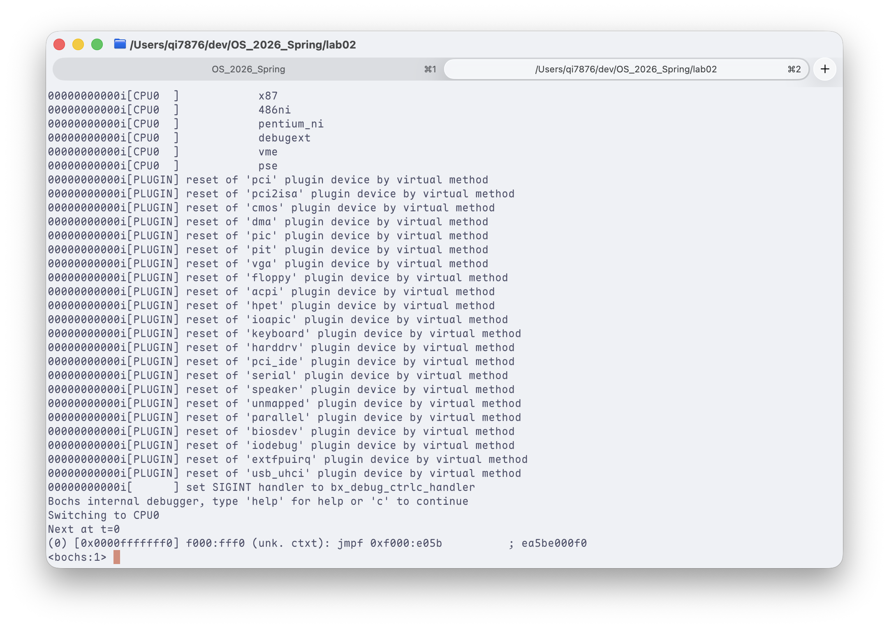

2. 在 Bochs 调试器中输入 `c`，继续启动 Linux 0.11。

   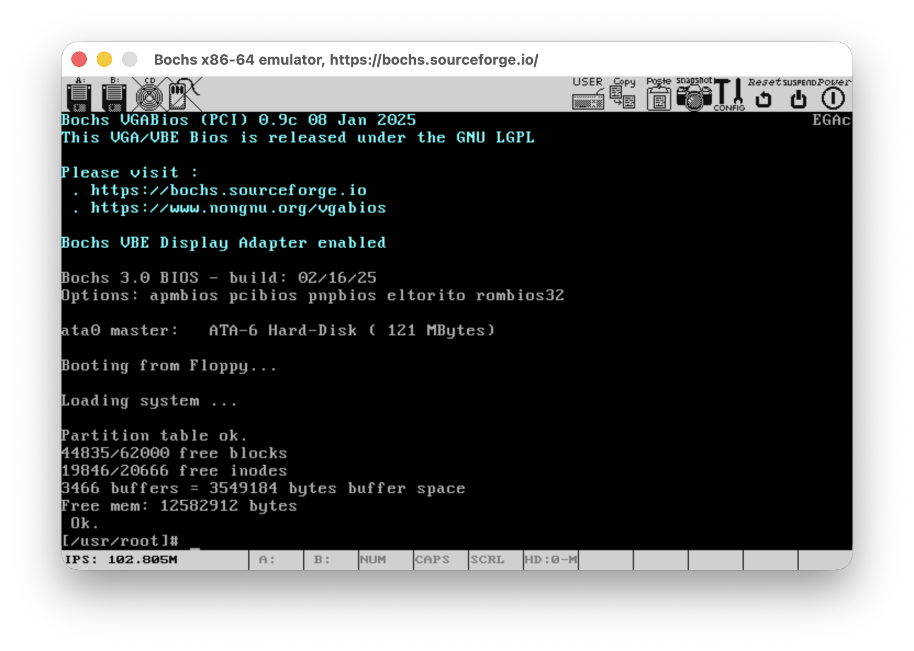

3. 在 Linux 0.11 中创建并编译实验程序：

   ```bash
   gcc a.c
   ./a.out
   ```

   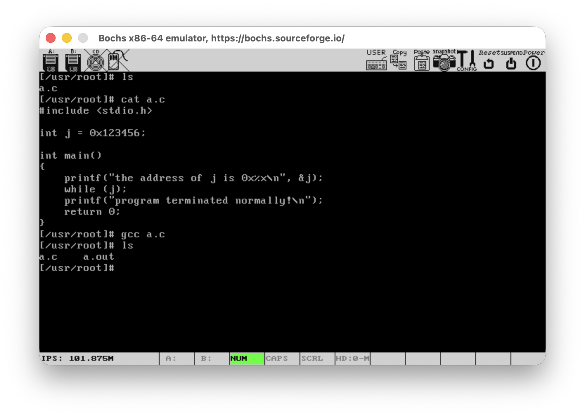

4. 记录程序输出的变量地址：

   ```text
   the address of j is 0x3004
   ```

   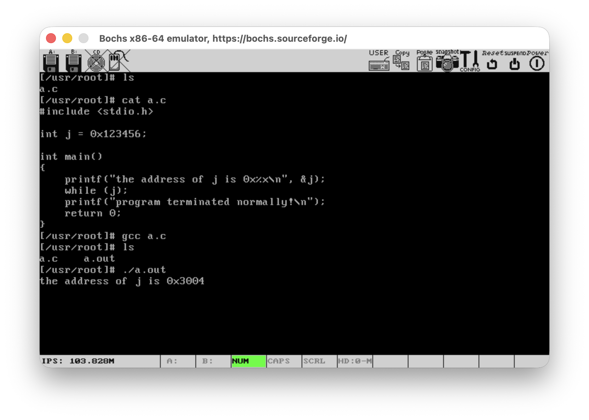

5. 程序进入死循环后，在 Bochs 调试器中暂停执行，查看段寄存器和控制寄存器：

   ```text
   sreg
   creg				
   ```

   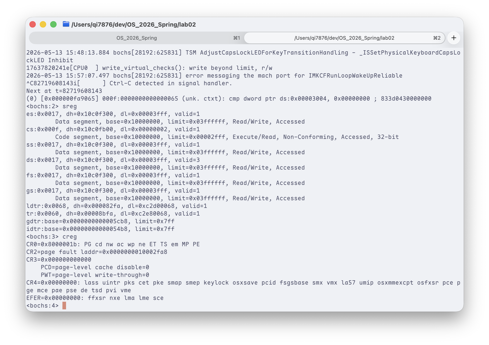

6. 根据 DS 和 LDTR/GDTR 找到当前进程数据段描述符，计算 `j` 的线性地址。

   可知：`ds base = 0x10000000`，`CR3 = 0x00000000`，`&j = 0x3004`

   故`j`的线性地址为`0x10003004`

7. 根据 CR3 和线性地址查找页目录项、页表项，计算 `j` 的物理地址。

   已知 `j` 的线性地址为 `0x10003004`，将其按 10 位页目录索引、10 位页表索引和 12 位页内偏移拆分：

   ```text
   页目录索引 = 0x10003004 >> 22 = 0x40
   页表索引   = (0x10003004 >> 12) & 0x3ff = 0x3
   页内偏移   = 0x10003004 & 0xfff = 0x004
   ```

   `creg` 显示 `CR3 = 0x00000000`，因此页目录基址为 `0x0`。页目录项地址为：

   ```text
   PDE 地址 = CR3 + 页目录索引 * 4
            = 0x0 + 0x40 * 4
            = 0x100
   ```

   在 Bochs 中查看该页目录项：

   ```text
   xp /w 0x100
   ```

   得到：

   ```text
   0x0000000000000100 <bogus+0>: 0x00fa5027
   ```

   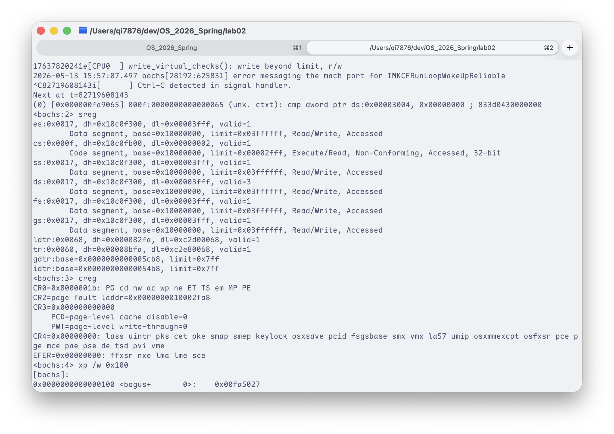

   页目录项的高 20 位为页表物理基址，低 12 位为属性位，因此：

   ```text
   页表基址 = 0x00fa5027 & 0xfffff000 = 0x00fa5000
   ```

   根据页表索引计算页表项地址：

   ```text
   PTE 地址 = 页表基址 + 页表索引 * 4
            = 0x00fa5000 + 0x3 * 4
            = 0x00fa500c
   ```

   接下来在 Bochs 中查看该页表项：

   ```text
   xp /w 0x00fa500c
   ```

   得到：

   ```text
   0x0000000000fa500c <bogus+0>: 0x00f9c067
   ```

   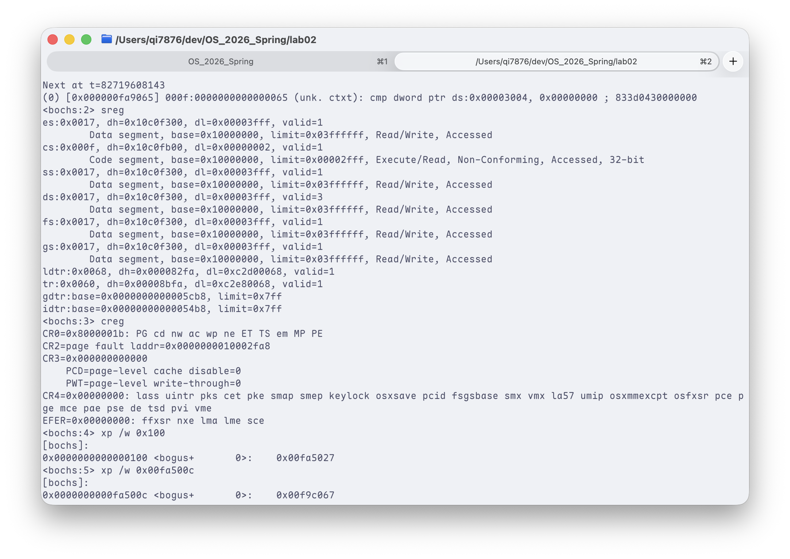

   页表项的高 20 位为物理页框基址，低 12 位为属性位，因此：

   ```text
   物理页框基址 = 0x00f9c067 & 0xfffff000 = 0x00f9c000
   ```

   最终物理地址为：

   ```text
   j 的物理地址 = 物理页框基址 + 页内偏移
               = 0x00f9c000 + 0x004
               = 0x00f9c004
   ```

8. 使用 `xp` 查看物理内存，确认当前位置保存的是 `j` 的值。由于 x86 为小端序，`0x123456` 在内存中按低字节在前存放。

   ```text
   xp /w 0x00f9c004
   ```

   得到：

   ```text
   0x0000000000f9c004 <bogus+0>: 0x00123456
   ```

   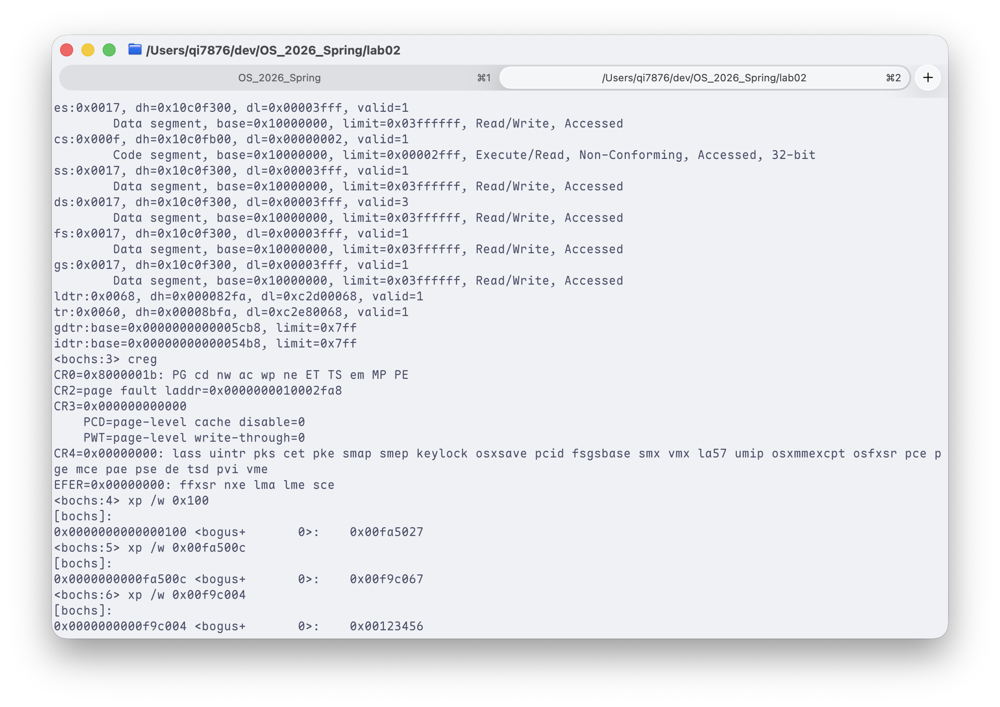

   该值与程序中 `j = 0x123456` 一致，说明物理地址计算正确。

9. 使用 `setpmem` 将该物理地址处的 4 字节值改为 `0`。

   ```text
   setpmem 0x00f9c004 4 0
   ```

   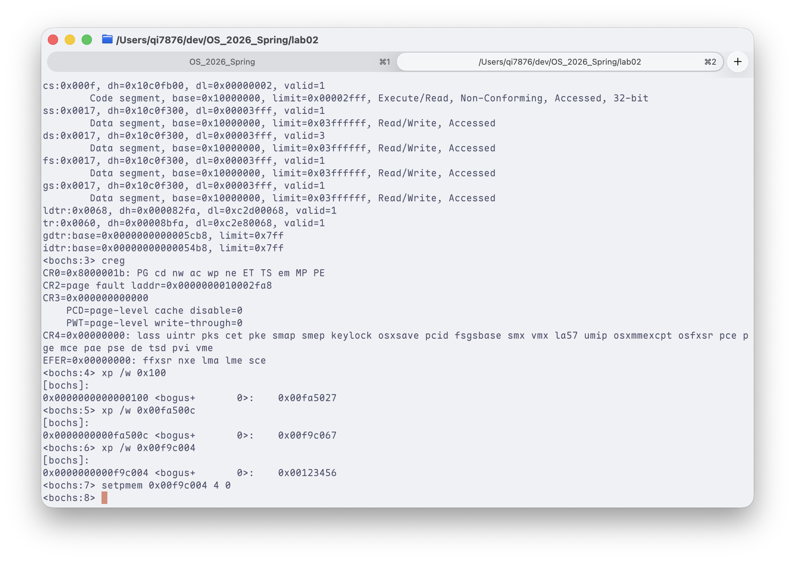

10. 在 Bochs 调试器中输入 `c` 继续运行，观察程序是否跳出循环并输出正常结束信息。

    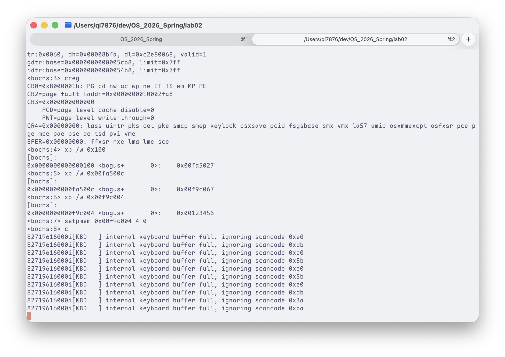

    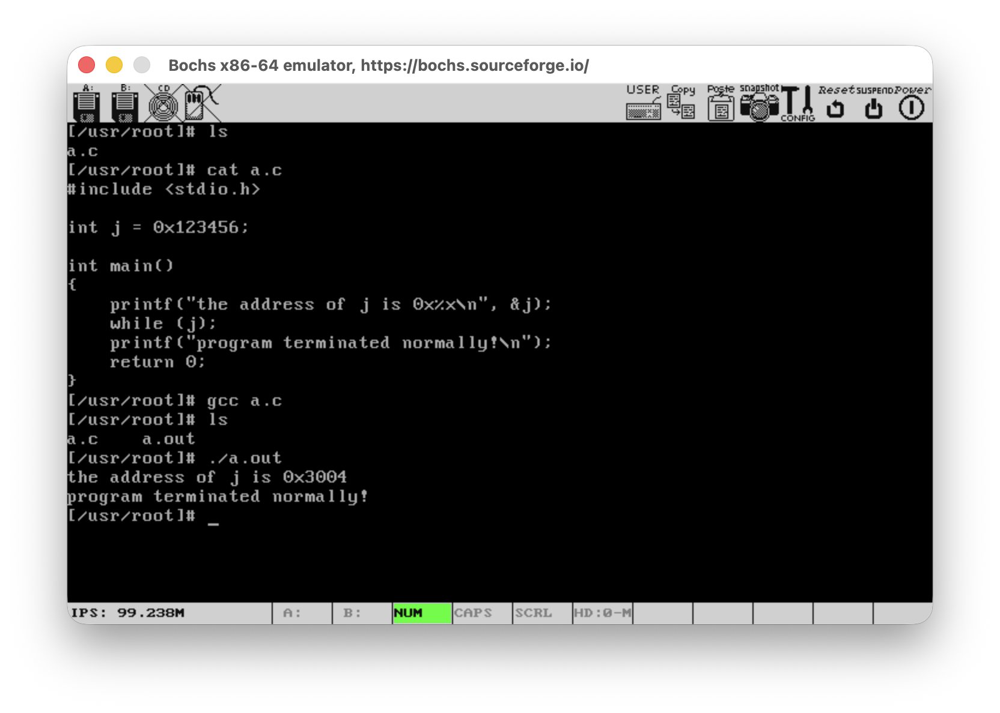

    程序跳出了循环并且正常结束。

## 六、地址转换记录

以下为本次实验的地址转换记录。

| 项目 | 记录值 |
| --- | --- |
| `&j` 段内偏移 | `0x3004` |
| DS 选择符 | `0x0017` |
| DS 段描述符内容 | `dh=0x10c0f300, dl=0x00003fff` |
| GDTR 基址 | `0x00005cb8` |
| LDTR 选择符 | `0x0068` |
| LDTR 描述符内容 | `dh=0x000082fa, dl=0xc2d00068` |
| LDT 描述符地址 | `0x00005d20` |
| LDT 基址 | `0x00fac2d0` |
| 数据段描述符地址 | `0x00fac2e0` |
| 数据段基址 | `0x10000000` |
| `j` 的线性地址 | `0x10003004` |
| CR3 页目录基址 | `0x00000000` |
| 页目录索引 | `0x40` |
| 页目录项地址 | `0x100` |
| 页目录项内容 | `0x00fa5027` |
| 页表基址 | `0x00fa5000` |
| 页表索引 | `0x3` |
| 页表项地址 | `0x00fa500c` |
| 页表项内容 | `0x00f9c067` |
| 物理页框基址 | `0x00f9c000` |
| 页内偏移 | `0x004` |
| `j` 的物理地址 | `0x00f9c004` |
| 物理地址验证值 | `0x00123456` |

线性地址拆分方式：

```text
线性地址 = 段基址 + 段内偏移
页目录索引 = 线性地址[31:22]
页表索引   = 线性地址[21:12]
页内偏移   = 线性地址[11:0]
物理地址   = 页表项高 20 位对应页框基址 + 页内偏移
```

## 七、实验结果

修改物理内存前，程序停留在：

```c
while (j);
```

通过地址转换计算出变量 `j` 的物理地址为 `0x00f9c004`。使用 `xp /w 0x00f9c004` 查看该物理地址，结果为 `0x00123456`，与程序中 `j` 的初值一致，说明地址转换结果正确。随后使用 Bochs 命令将该地址处的 4 字节值改为 `0`：

```text
setpmem 0x00f9c004 4 0
```

继续运行后，程序输出：

```text
program terminated normally!
```

这说明手工计算得到的物理地址与变量 `j` 的实际存储位置一致，段页式地址转换过程验证成功。

## 八、问题记录与分析

1. Windows 版配置不能直接在 macOS 使用。主要问题是 GUI 后端、BIOS 路径和镜像路径均依赖 Windows 环境。
2. Homebrew Bochs 3.0 的 BIOS 文件可以通过 `$BXSHARE` 引用，这样跨环境兼容性更好。
3. 旧配置中的 `gameport` 插件在当前 Homebrew Bochs 插件目录中不存在，会导致启动失败，因此需要移除。
4. Bochs 3.0 不再接受旧配置中的 `model=bx_generic` 写法，需要改为预定义 CPU 模型。
5. 旧配置中部分网卡、声卡指令即使设置为 `enabled=0`，在当前 Bochs 构建中也可能因为指令不存在而报错。实验不依赖这些设备，删除即可。
6. 地址计算时需要注意表项大小：GDT/LDT 描述符为 8 字节，页目录项和页表项为 4 字节。
7. 使用 `xp` 查看内存时需要注意小端序，不能直接按显示字节顺序误判整数值。

## 九、实验总结

本实验将程序变量地址的变化过程拆解为“逻辑地址到线性地址”和“线性地址到物理地址”两个阶段。通过读取段寄存器、描述符表、控制寄存器和页表内容，可以手工复现处理器的地址转换过程。最终通过直接修改物理内存使程序跳出死循环，说明分页和分段结构中的各项计算结果能够对应到真实运行状态。
